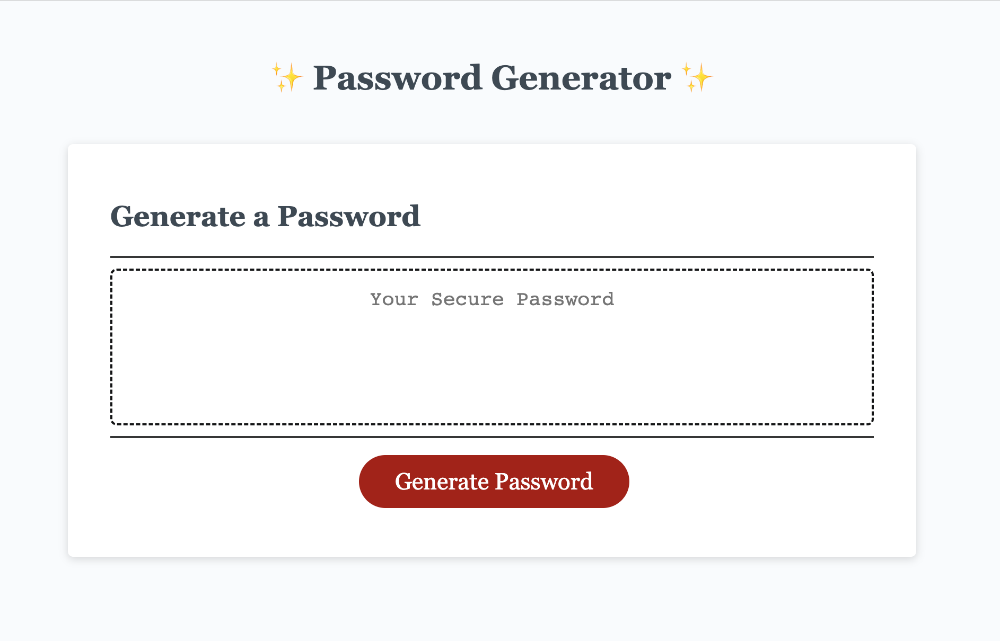
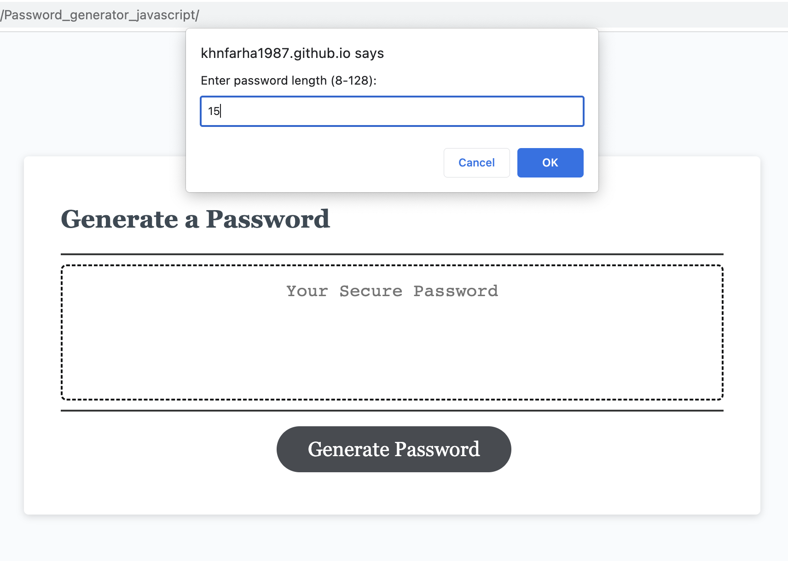
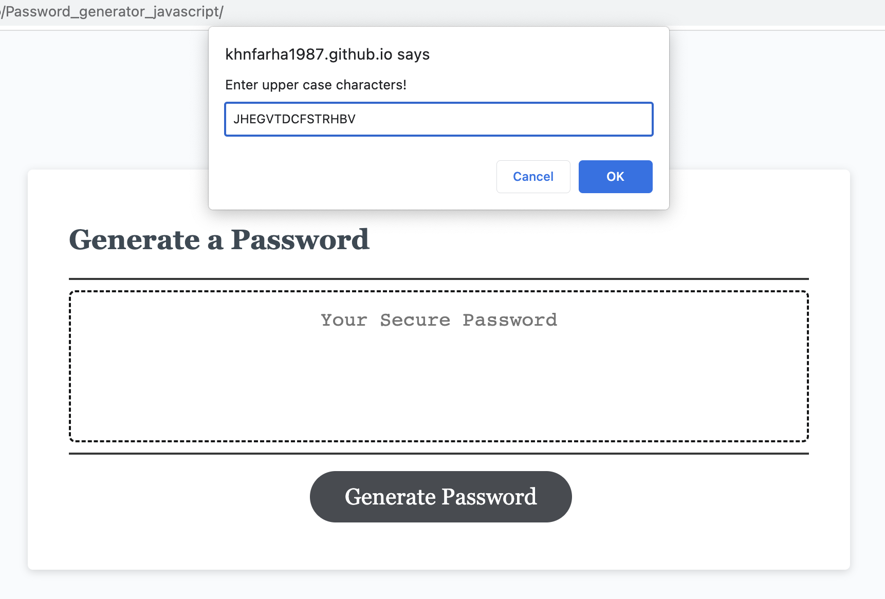
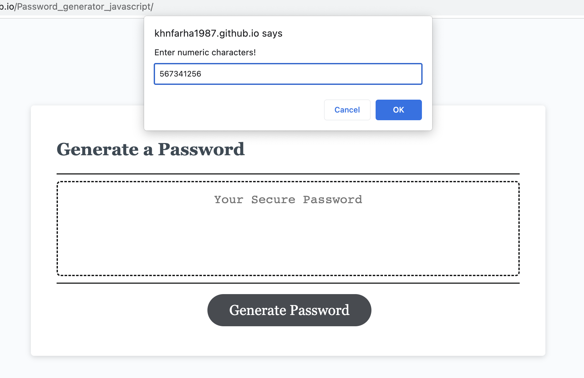
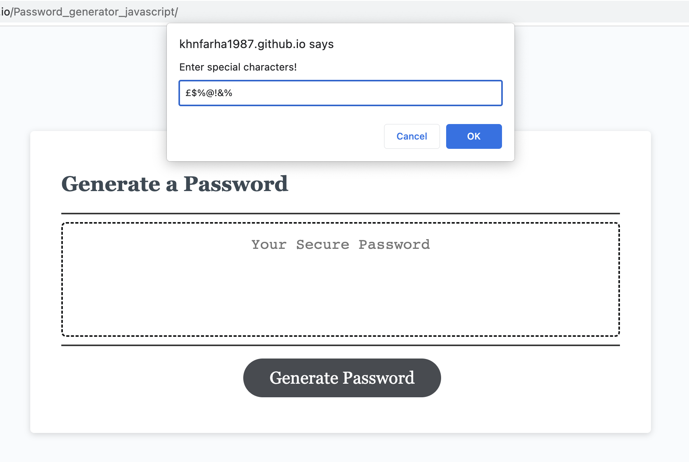
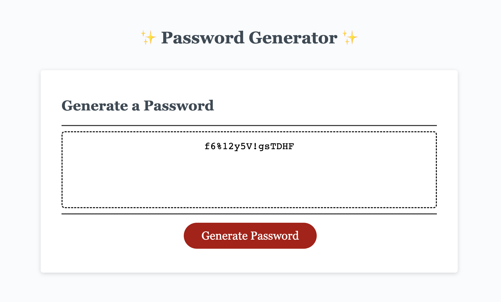

# Intermediate JavaScript: Password Generator
Challenge 5 : This week’s Challenge requires me to create an application that an employee can use to generate a random password based on criteria they’ve selected by modifying starter code. 

# Project Requirements:
This application should have following requirements:
  * Generate a password when the button is clicked.
  
  * Present a series of prompts for password criteria:
    * Length of password:
    * At least 8 characters but no more than 128.
    * Character types:
    * Lowercase
    * Uppercase
    * Numeric
    * Special characters ($@%&*, etc.)
  
  * Code should validate for each input and at least one character type should be selected.
  
  * Once all prompts are answered, the password should be generated and displayed in an alert or written to the page.

# Description of this Project:

  * I will create an app that runs in the browser and features dynamically updated HTML and CSS, all powered by JavaScript code that I will write. My app will have a clean and polished user interface that is responsive, ensuring that it adapts to multiple screen sizes.
  
  * A program that randomly generates a password based on inputs from the user. Accepts lowerCase, upperCase, numbers, and Special Characters. Also allows user to choose a length between 8 - 128. Uses prompts to ask and accept inputs from the user.

# git hub live url https://khnfarha1987.github.io/Password_generator_javascript/

# array included with lots of characters lower case, upper case, number and special.

# Initialize password options

# Prompt for password length: At least 8 characters but no more than 128

# Prompt for character types: checking lower character present in the array

# Prompt for character types: checking upper character present in the array

# Prompt for character types: checking number character present in the array

# Prompt for character types: checking special character present in the array

# Function for getting a random element from an array using method.random method

# Function to generate password with user input

# looping to generate password with required specification using do and while loop

# Write password to the #password input
