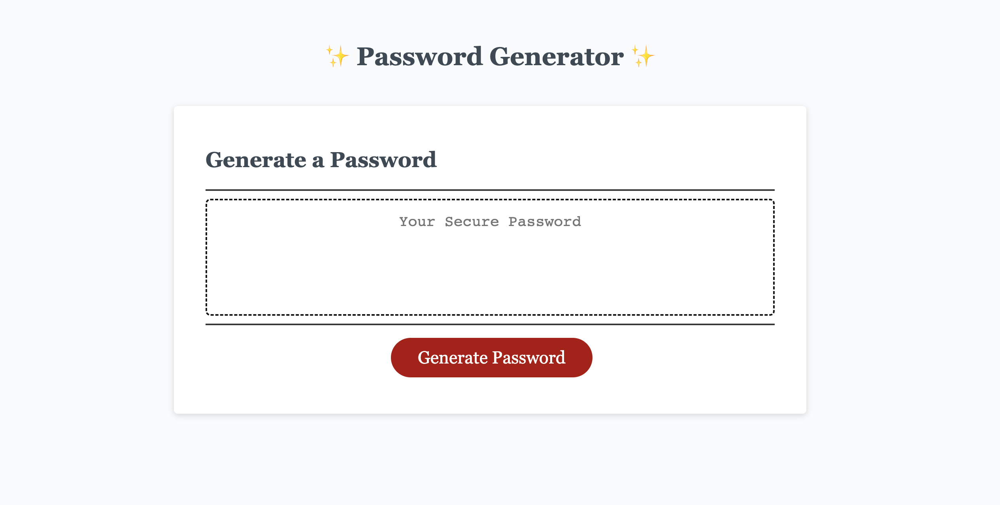

# Intermediate JavaScript: Password Generator
Challenge 5 : This week’s Challenge requires me to create an application that an employee can use to generate a random password based on criteria they’ve selected by modifying starter code. 

# Project Requirements:
This application should have following requirements:
  * Generate a password when the button is clicked.
  
  * Present a series of prompts for password criteria:
    * Length of password:
    * At least 8 characters but no more than 128.
    * Character types:
    * Lowercase
    * Uppercase
    * Numeric
    * Special characters ($@%&*, etc.)
  
  * Code should validate for each input and at least one character type should be selected.
  
  * Once all prompts are answered, the password should be generated and displayed in an alert or written to the page.

# Description of this Project:

  * I will create an app that runs in the browser and features dynamically updated HTML and CSS, all powered by JavaScript code that I will write. My app will have a clean and polished user interface that is responsive, ensuring that it adapts to multiple screen sizes.
  
  * A program that randomly generates a password based on inputs from the user. Accepts lowerCase, upperCase, numbers, and Special Characters. Also allows user to choose a length between 8 - 128. Uses prompts to ask and accept inputs from the user.

  * I learned functions and it can work for password generate-
    * function getPasswordOptions()
       * objects can  multiple values of multiple types, that belong to one category.(object to store all user password preferences)
      
    * function getRandom(arr)
       * I used the Math.floor() and Math.random() methods to generate a random number from a given range of numbers.
  
    * function generatePassword()  
       * I used if statement and for loop to generate password.
       * I used array into a single string by using the .join method 

# Technologies Used:
  * HTML
  * CSS
  * JavaScript

# Image Links of this Project:
   * Present a series of prompts for password criteria:
     

   * At least 8 characters but no more than 128.
     

   * Lowercase
     

   * Uppercase
      

   * Numeric
      

   * Special characters ($@%&*, etc.)
     

  * Generate a password when the button is clicked.
     

# Video Link of this Project:     
   

# Application GitHub URL:
https://github.com/khnfarha1987/Password_generator_javascript

# Application Deployed live URL:
https://khnfarha1987.github.io/Password_generator_javascript/
